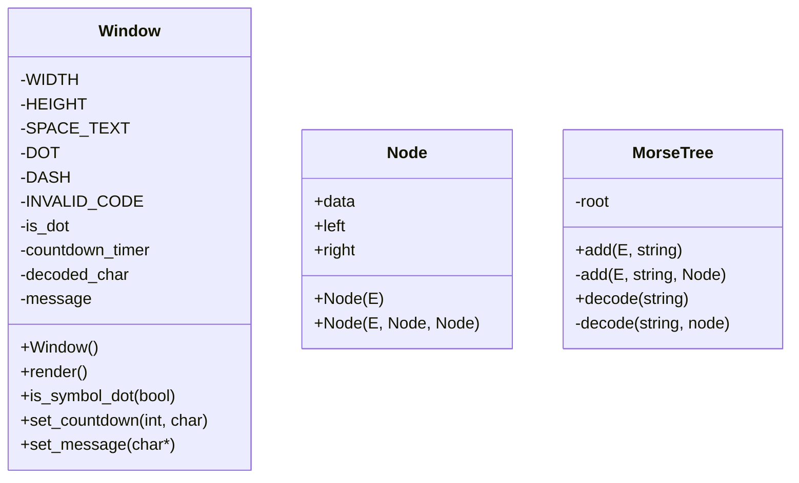
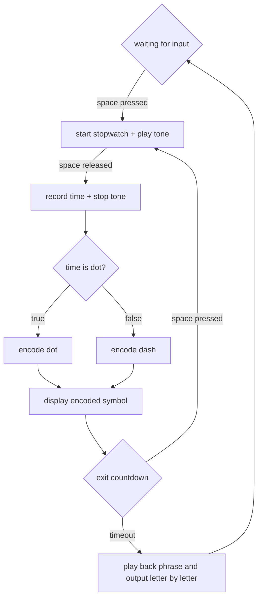

## compiling
first compile raylib following the instructions below:
* [Compiling for GNU Linux](https://github.com/raysan5/raylib/wiki/Working-on-GNU-Linux)
* [Compiling For Windows](https://github.com/raysan5/raylib/wiki/Working-on-Windows)

once raylib has been installed on the target system, the project can be run:
```
make
```

## uml

---

## Program Flow



